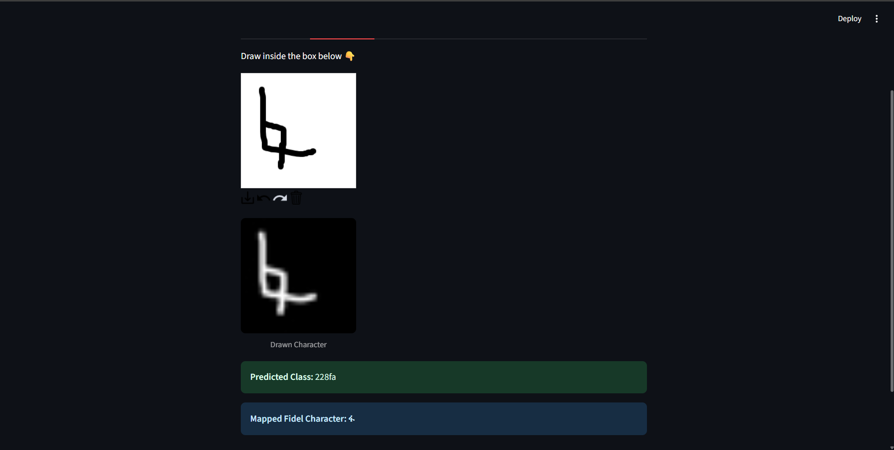
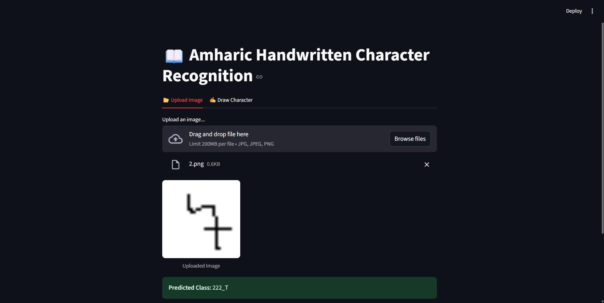

# Amharic Handwritten Character Recognition

This project is a **Deep Learning + Streamlit web app** for recognizing handwritten **Amharic fidel characters** (34 root groups × 7 orders).
It uses a **CNN model built with TensorFlow/Keras**, trained on a custom dataset of handwritten Amharic letters, and serves predictions through a Streamlit interface.

Author : [Kenean Dita](https://github.com/KeneanDita)

## Sample outputs

- Using the canvas inside the webapp



- By uploading an image to the webapp



## Features

* **CNN model** trained on 32×32 grayscale images of handwritten fidel.
* Supports **34 × 7 = 238 Amharic characters**.
* **Streamlit web app** for interactive testing.
* Dataset images stored in a single `data/` folder.
* **Label mapping** from dataset class names → real Amharic letters.

## Project Structure

```PS
.
├── data/                    # Dataset (images of letters)
├── Models/
│   ├── amharic_cnn.h5       # Trained CNN model
│   ├── class_names.npy      # Encoded class labels
├── UI.py                    # Streamlit web app
├── training_notebook.ipynb  # Training notebook
├── requirements.txt         # Python dependencies
├── License
├── Dockerfile               # For containerizaiton purposes
├── README.md                # Project documentation
```

## Usage

### Environment Setup

Clone the repo:

```bash
git clone https://github.com/KeneanDita/Fidel-Vision
cd .\fidel-vision
```

Create a virtual envionment and install dependencies

```bash
python -m venv env
.\env\source\activate  # for windows
source env\source\activate # for linux/mac
pip install -r requirements.txt
```

### Train the model (optional)

If you want to retrain:

```bash
jupyter notebook train.ipynb
```

### Run the Streamlit app

```bash
streamlit run app.py
```

* Upload a handwritten Amharic character image or draw using the second tab as an option.
* The app preprocesses it → feeds it into the CNN → predicts the fidel.

## Model

* Input size: **32×32 grayscale** but accepts 28x28 and 63x64 too
* Architecture:

  * Conv2D(32) → MaxPool → Conv2D(64) → MaxPool → Conv2D(128)
  * Flatten → Dense(256, relu) → Dense(238, softmax)
* Optimizer: **Adam**

## Amharic Fidel Mapping

I used the **Amharic syllabary table (34 roots × 7 orders)** to map model outputs into their corresponding fidel characters, e.g.:

```P
ሀ ሁ ሂ ሃ ሄ ህ ሆ
ለ ሉ ሊ ላ ሌ ል ሎ
መ ሙ ሚ ማ ሜ ም ሞ
...
ፐ ፑ ፒ ፓ ፔ ፕ ፖ
```

### Acknowledgements

* Dataset: [Custom handwritten Amharic letters.](https://www.kaggle.com/datasets/shahabdulmazid/handwritten)
* Frameworks: [TensorFlow](https://www.tensorflow.org/), [Streamlit](https://streamlit.io/).
